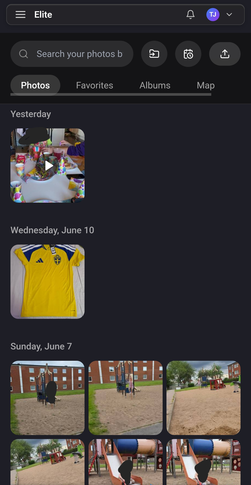
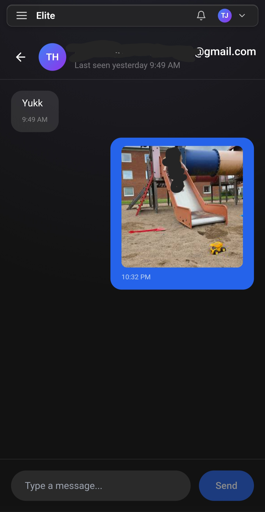
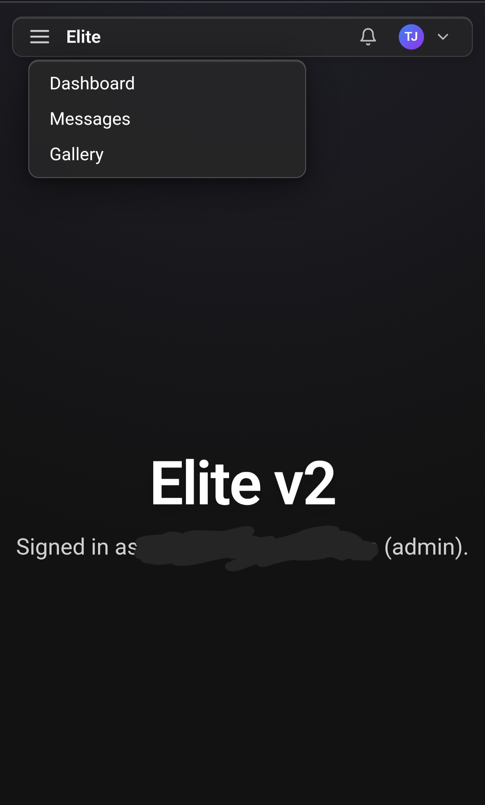
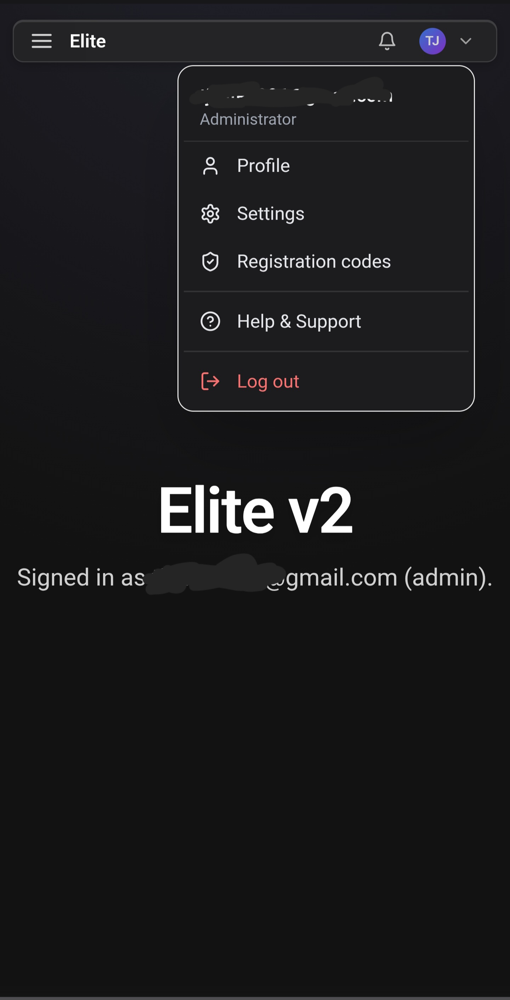

# Elite v2

A private, invite-only personal hub: a shared photo/video gallery, short-video
and post feeds, a shared bookshelf, an in-app app store, real-time messaging,
and account management behind a glassmorphic, macOS menu-bar style interface.



## Features

- **Invite-only auth** — registration requires an admin-generated code (or an
  approved invite request); sessions use signed JWT cookies (`jose`) with a
  `jti` so they can be revoked server-side. Device/session list and remote
  sign-out live in Settings. DB-backed login throttling guards `/api/auth/login`.
- **Gallery** — upload and browse photos and videos with EXIF parsing
  (`exifr` / `exif-reader`), `sharp` thumbnails, tags, a map view (`leaflet`)
  for geotagged media, trash, and client-side smart collections
  (Videos / Places / Years). Per-user storage with album sharing via public
  links.
- **Shorts** — a TikTok-style vertical video feed with an immersive player,
  per-user public/private clips, playlists, and a PIN-gated 18+ section
  (`/shorts18`). Clips can be grabbed from external sources via the `ladda`
  backend, auto-polled, transcoded, and deduplicated.
- **Posts** — an Instagram-style feed with likes, comments, follows, stories,
  search, rich markdown composing (`react-markdown` + `remark-gfm`),
  `@mention` autocomplete, and link-preview cards.
- **People & profiles** — a unified `/people/<username>` directory; each profile
  has custom fields with per-field visibility, badges, an avatar with crop, and
  member stats.
- **Books** — a shared EPUB / PDF / CBZ reader (`epubjs`, `pdfjs-dist`,
  `jszip`) with per-user reading progress.
- **App Store** — an in-app `/store` catalog of installable "apps" plus an APK
  archive that imports from GitHub / F-Droid / Play, auto-updates, and verifies
  APK signatures (trust-on-first-use). Adult apps are PIN-gated.
- **Messaging** — real-time direct messages and group channels with presence
  (`last_seen`), reactions, replies, edits, and soft-delete, over a WebSocket
  endpoint served alongside Next.js by a custom server.
- **Instagram sync** — profile-driven, cookie-based import that routes photos to
  posts and videos to shorts (`gallery-dl`).
- **PWA & Web Push** — installable progressive web app (manifest, service
  worker, icons) with `web-push` (VAPID) notifications.
- **Appearance** — per-user accent color and dark background themes, applied
  without a flash on load.
- **Admin** — generate and manage registration codes, review invite requests,
  manage the store catalog, and content-owner "act-as" impersonation.
- **Account** — profile, settings, password change, and account deletion.

## Tech stack

- **Next.js 14** (App Router) + **React 18**, **TypeScript**
- **Tailwind CSS 3** + **shadcn**-style UI on **Ark UI** primitives
- **better-sqlite3** (SQLite, WAL mode) for storage; **Kysely** builds queries,
  `better-sqlite3` executes them synchronously
- **ws** for the WebSocket layer, run from a custom server (`server.mjs`)
- **nodemailer** for invite/notification email
- **web-push** for push notifications
- `sharp`, `exifr` / `exif-reader`, `leaflet`, `epubjs`, `pdfjs-dist`,
  `react-markdown`
- Packaged as a multi-stage **Docker** image, run behind **Traefik**

## Getting started

Requires Node.js 18.

```bash
# 1. Get the code
git clone https://github.com/tjelite1986/elite-v2.git
cd elite-v2

# 2. Install dependencies
npm install

# 3. Configure environment (see Configuration below)
#    Create a .env file with at least JWT_SECRET, ADMIN_EMAIL and ADMIN_PASSWORD.

# 4. Run the dev server
npm run dev        # http://localhost:3020
```

For a production deployment, build and run the Docker image behind Traefik
instead — see [Deployment](#deployment).

### Scripts

| Script          | Description                                  |
| --------------- | -------------------------------------------- |
| `npm run dev`   | Start the dev server on port 3020            |
| `npm run build` | Production build                             |
| `npm start`     | Run the production custom server (`server.mjs`) |
| `npm run lint`  | Run ESLint                                    |

Background jobs (Instagram/shorts/posts import, polling, transcoding,
duplicate scans, story cleanup, app-update checks) run as host **systemd
timers** — see `deploy/systemd/` and `scripts/systemd/`. The corresponding
scripts live in `scripts/`.

## Configuration

Configure via environment variables (e.g. an `.env` file — not committed):

### Core

| Variable                      | Description                                          |
| ----------------------------- | ---------------------------------------------------- |
| `JWT_SECRET`                  | **Required.** Secret used to sign session JWTs.      |
| `ADMIN_EMAIL` / `ADMIN_PASSWORD` | Seed the initial admin account on first run.       |
| `DATA_DIR`                    | Data directory (default: `./data`). Holds the SQLite DB. |
| `APP_URL`                     | Public base URL, used in outgoing email/push links.  |
| `PORT` / `HOSTNAME`           | Bind address for the production server (default `0.0.0.0:3000`). |

### Storage roots

| Variable        | Description                                            |
| --------------- | ----------------------------------------------------- |
| `PROFILE_ROOT`  | Per-user content root (`u_<user>/…` for posts, shorts, gallery, imports). |
| `GALLERY_ROOT`  | Gallery storage root (default: `<DATA_DIR>/gallery`).  |
| `POSTS_ROOT`    | Posts media storage root.                              |
| `SHORTS_ROOT`   | Shorts media storage root.                             |
| `BOOKS_ROOT`    | Bookshelf storage root (EPUB / PDF / CBZ).             |
| `APPSTORE_ROOT` / `STORE_DIR` | App Store catalog / APK archive storage.|

### Email

| Variable        | Description                                            |
| --------------- | ----------------------------------------------------- |
| `MAIL_FROM`     | "From" address for outgoing email.                    |
| `SMTP_HOST` / `SMTP_PORT` / `SMTP_USER` / `SMTP_PASS` | SMTP credentials for `nodemailer`. |

### Web Push

| Variable          | Description                                          |
| ----------------- | --------------------------------------------------- |
| `VAPID_PUBLIC_KEY` / `VAPID_PRIVATE_KEY` / `VAPID_SUBJECT` | VAPID keys for `web-push`. |

### Import / integrations

| Variable              | Description                                          |
| --------------------- | --------------------------------------------------- |
| `IMPORT_DIR` / `POSTS_IMPORT_DIR` / `SHORTS_IMPORT_DIR` | Directories scanned for bulk import. |
| `IMPORT_CRON_SECRET`  | Shared secret for import trigger endpoints.         |
| `LADDA_URL`           | URL of the `ladda` media-grabber backend (shorts "Grab"). |
| `IG_COOKIES_PATH` / `IG_SRC` | Instagram cookie file and source for sync.   |
| `GALLERY_DL_BIN` / `YT_DLP_BIN` / `CURL_IMPERSONATE_BIN` | Paths to external download tools. |
| `GITHUB_TOKEN` / `FDROID_REPO_URL` | App Store import sources.             |
| `APP_UPDATE_URL` / `APP_UPDATE_SOURCE` / `APP_UPDATE_SECRET` / `APP_UPDATE_PULL` | App auto-update wiring. |
| `ADULTS_EMAIL` / `PUBLIC_EMAIL` | Seeded content-owner accounts.            |

> The app uses a custom server (`server.mjs`) rather than Next's `standalone`
> output, because the WebSocket endpoint (`/api/ws`) is hosted in the same
> process as Next.

## Deployment

Built and run as a Docker container behind a [Traefik](https://traefik.io)
reverse proxy that terminates TLS (Let's Encrypt via the Cloudflare DNS
challenge).

```bash
docker compose build
docker compose up -d
```

> Operationally deployed from `docker2/compose/elitev2/` on the host (that dir
> holds the `.env` and the Traefik labels below). `--no-cache` is only needed
> when `package.json` changes.

The SQLite database and uploaded media live in a persistent volume mounted at
`DATA_DIR` (plus the dedicated storage roots above).

### Putting it behind Traefik

The container does **not** publish ports. Traefik discovers it over a shared
Docker network and routes by hostname, so both the app and Traefik must be on
the same external network (here named `traefik`):

```yaml
# docker-compose.yml (excerpt)
services:
  elitev2:
    build:
      context: /home/thomas/code/elite-v2
      dockerfile: Dockerfile
    container_name: elitev2
    restart: unless-stopped
    networks:
      - traefik           # same external network Traefik runs on
    environment:
      - NODE_ENV=production
      - PORT=3000         # internal port Traefik forwards to
      - HOSTNAME=0.0.0.0
      # ...app env vars (see Configuration) loaded from .env...
    volumes:
      - elitev2_data:/app/data
      # ...storage-root bind mounts...
    labels:
      - "traefik.enable=true"
      - "traefik.http.routers.elitev2-secure.rule=Host(`elitev2.mecloud.win`)"
      - "traefik.http.routers.elitev2-secure.entrypoints=https"
      - "traefik.http.routers.elitev2-secure.tls=true"
      - "traefik.http.routers.elitev2-secure.tls.certresolver=cloudflare"
      - "traefik.http.services.elitev2-service.loadbalancer.server.port=3000"

volumes:
  elitev2_data:

networks:
  traefik:
    external: true        # created/owned by the Traefik stack
```

What each label does:

| Label | Purpose |
| ----- | ------- |
| `traefik.enable=true` | Opt this container in to Traefik routing. |
| `routers.elitev2-secure.rule=Host(...)` | Match requests for the public hostname. Point a DNS record at the host. |
| `routers.elitev2-secure.entrypoints=https` | Serve on the HTTPS entrypoint (`:443`). |
| `routers.elitev2-secure.tls=true` + `tls.certresolver=cloudflare` | Terminate TLS using the `cloudflare` ACME resolver defined in Traefik's static config. |
| `services.elitev2-service.loadbalancer.server.port=3000` | Forward to the container's internal port (`PORT`), since no ports are published. |

Prerequisites on the Traefik side (configured once, in Traefik's own static
config — not here):

- An `https` entrypoint on `:443` (with an `http` → `https` redirect on `:80`).
- A `cloudflare` `certResolver` using the Cloudflare DNS-01 challenge
  (Cloudflare API token + ACME email), so wildcard/subdomain certs for
  `*.mecloud.win` are issued automatically.
- The external `traefik` Docker network, which this stack joins.

When all of that is in place, `docker compose up -d` is enough — Traefik picks
up the new container via the Docker provider and starts routing
`https://elitev2.mecloud.win` to it.

## Screenshots

| Messaging | Navigation | Account menu |
| --------- | ---------- | ------------ |
|  |  |  |

## CI

GitHub Actions runs on every push and pull request to `main`:

- **Typecheck & build** — `tsc --noEmit` and `next build`. Because the lockfile
  is generated on arm64 (Raspberry Pi), the workflow installs the linux-x64
  `sharp` binary explicitly before building.
- **npm audit** — fails the build on `critical` vulnerabilities; `high` and
  `moderate` are reported but non-blocking (the known Next.js 14.x DoS advisories
  have no fix without a major upgrade).

Dependency updates are managed by Dependabot (npm and GitHub Actions, weekly).
