# Elite v2

[](https://github.com/tjelite1986/elite-v2/actions/workflows/ci.yml)


A private, invite-only personal hub: a shared photo/video gallery, short-video
and post feeds, a long-form video library, a shared bookshelf, an in-app app
store, real-time messaging, and account management behind a dark, mobile-first
interface built around a single bottom navigation bar.

Think of it as a self-hosted mix of Google Photos, Instagram, TikTok, YouTube,
Messenger and an app store — running on your own hardware, for a closed circle
of people you invite.

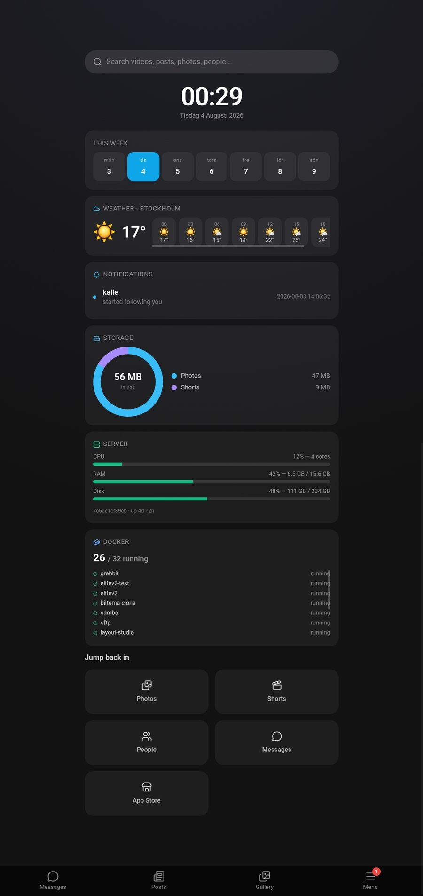

**New here?** Jump to [Getting started](#getting-started) — it assumes no prior
experience. **Here for the internals?** See
[Architecture](#architecture--how-it-works-under-the-hood).

- [Demo](#demo) · [Screenshots](#screenshots)
- [Features](#features)
- [Tech stack](#tech-stack) · [Architecture](#architecture--how-it-works-under-the-hood)
- [Guides](#guides) · [Getting started](#getting-started)
- [Background jobs](#background-jobs-optional--only-for-a-real-server) · [Importing media](#importing-your-own-media-drop-folders)
- [Configuration](#configuration) · [Deployment](#deployment)
- [Troubleshooting](#troubleshooting) · [CI](#ci)

## Demo

> Captured on a sandbox instance seeded with placeholder media. Thumbnails in
> the 18+ section are additionally obscured.

| Profile | App Store | Shorts |
| ------- | --------- | ------ |
| 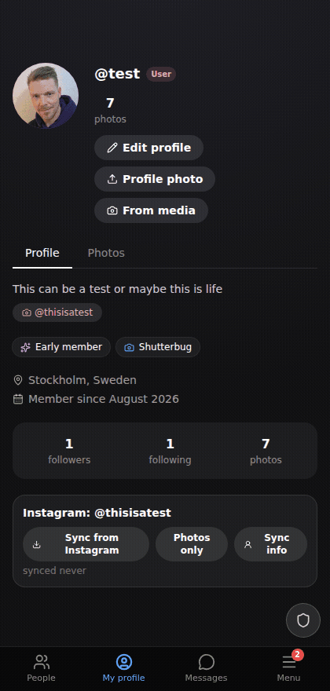 | 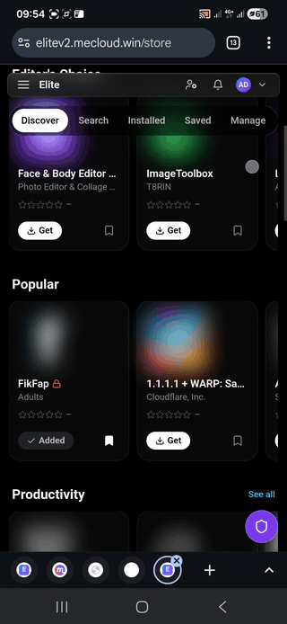 | 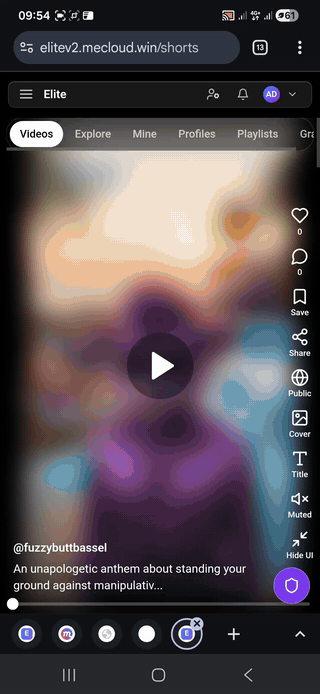 |

| Settings | Library tools | Admin tools |
| -------- | ------------- | ----------- |
| 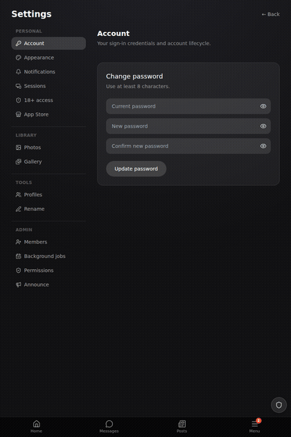 | 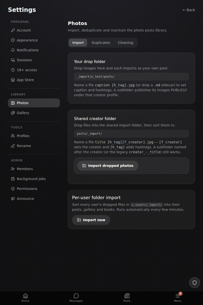 | 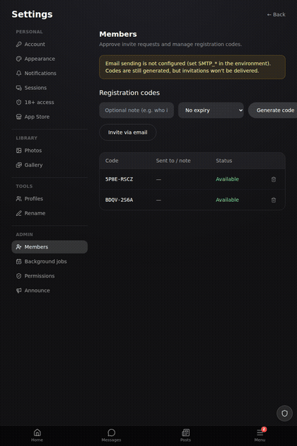 |

| Background jobs |
| --------------- |
| 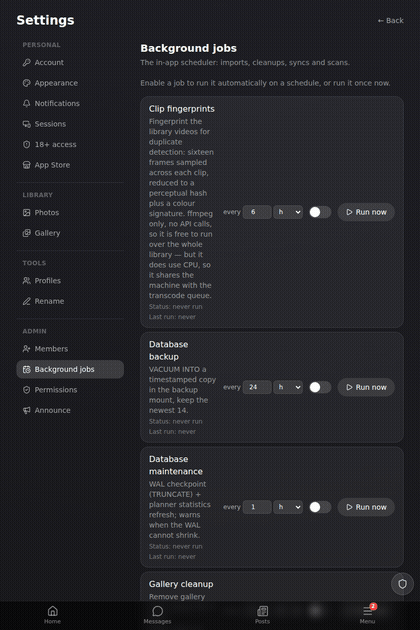 |

## Screenshots

| Dashboard | Menu | Notifications |
| --------- | ---- | ------------- |
|  | 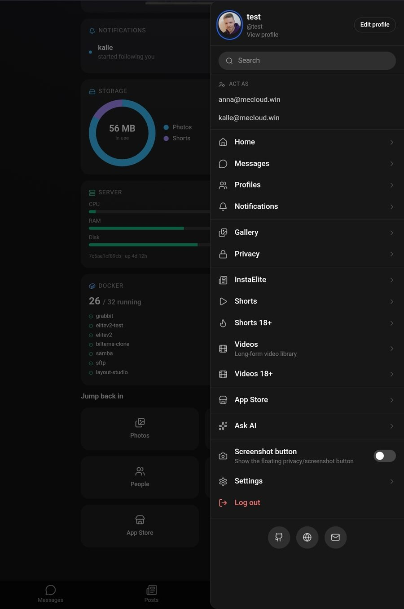 | 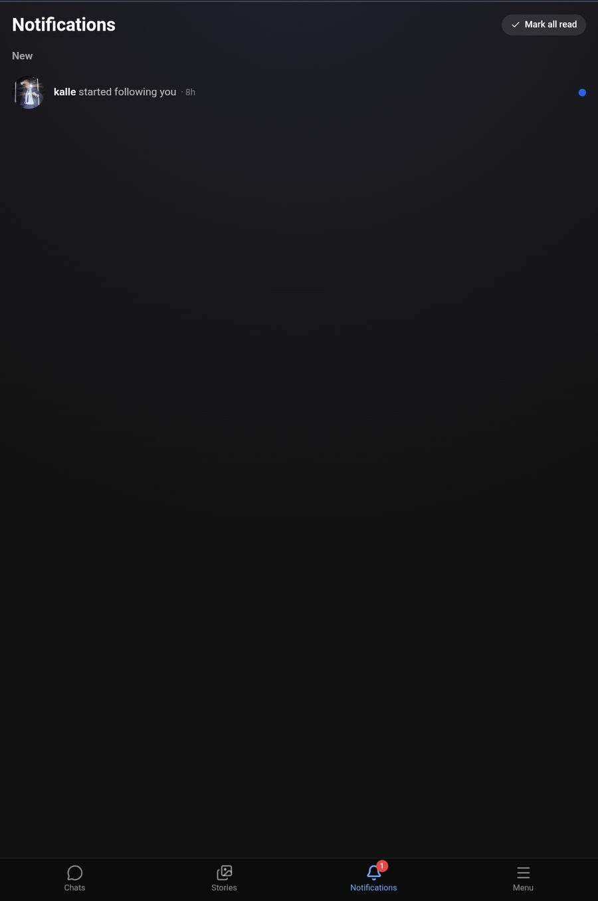 |

| Messages | Channels | Stories |
| -------- | -------- | ------- |
| 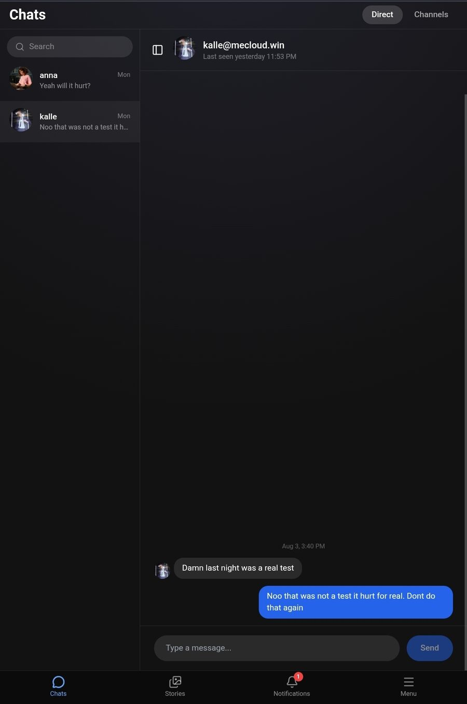 | 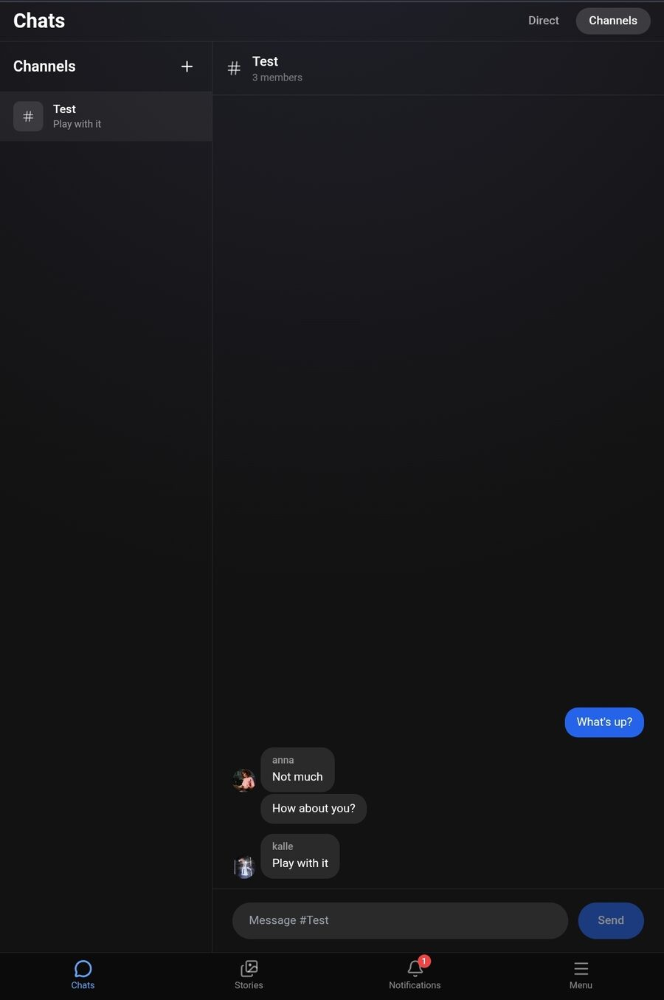 | 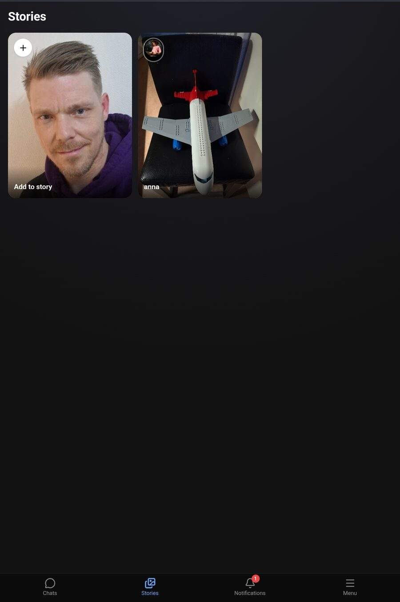 |

| Posts feed | Explore | Ask AI |
| ---------- | ------- | ------ |
| 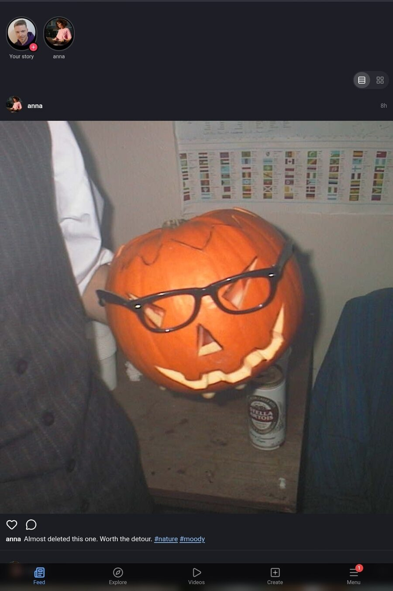 | 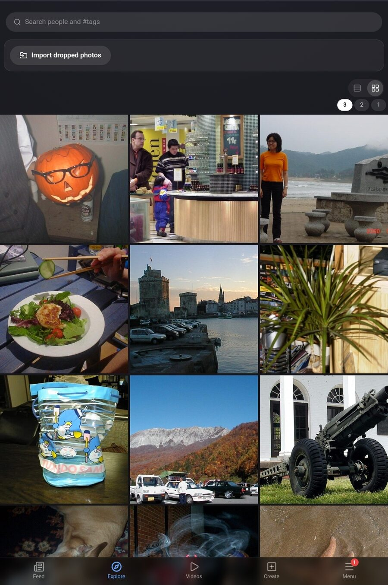 | 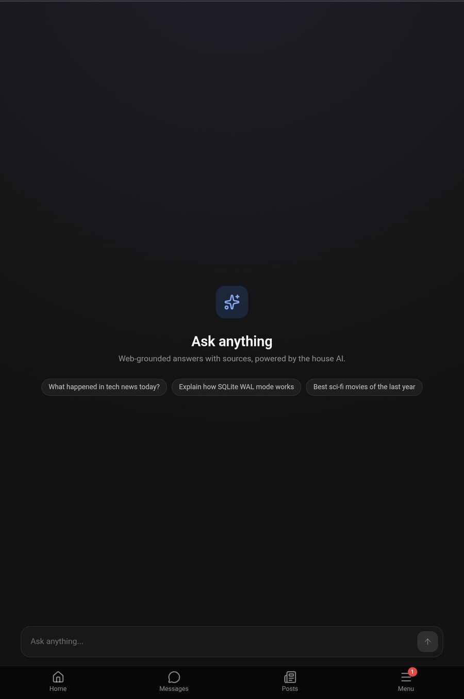 |

| Videos | Video player | People |
| ------ | ------------ | ------ |
| 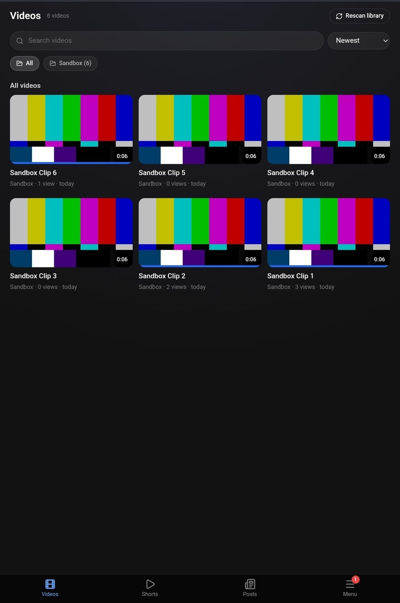 | 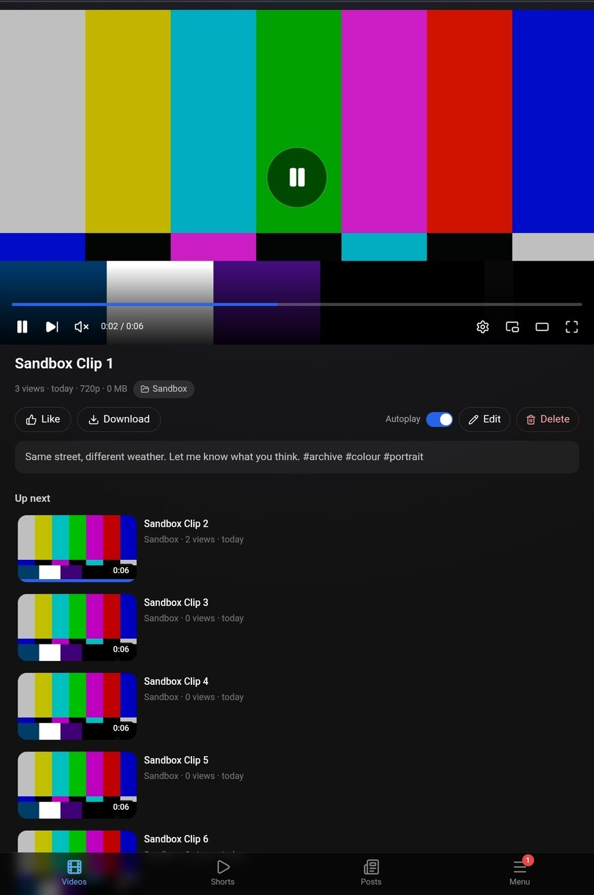 | 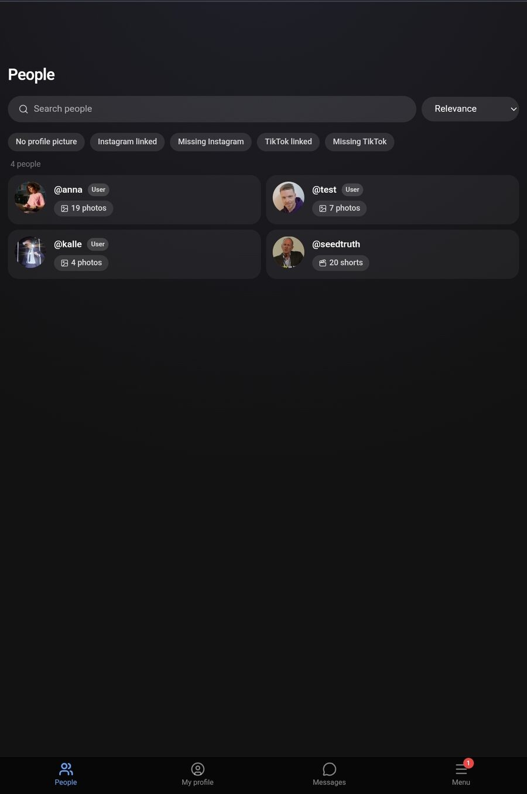 |

## Features

- **Invite-only auth** — registration requires an admin-generated code (or an
  approved invite request); sessions use signed JWT cookies (`jose`) with a
  `jti` so they can be revoked server-side. Device/session list and remote
  sign-out live in Settings. DB-backed login throttling guards `/api/auth/login`.
- **Home dashboard** — live widgets for weather (Open-Meteo), server stats
  (CPU / RAM / disk), Docker container status, a clock, and recently added
  media.
- **Gallery** — upload and browse photos and videos with EXIF parsing
  (`exifr` / `exif-reader`), `sharp` thumbnails and BlurHash placeholders,
  tags, a map view (`leaflet`) for geotagged media, trash, and client-side
  smart collections (Videos / Places / Years). Per-user storage; albums can be
  shared as a public `/share/<token>` link or downloaded as a ZIP.
- **Memories** — an "On this day" view that resurfaces media from the same
  date in previous years.
- **Shorts** — a TikTok-style vertical video feed with an immersive player,
  per-user public/private clips, playlists, and a PIN-gated 18+ section
  (`/shorts18`). Explore and every profile offer a **grid / feed view toggle**,
  and clips are editable (title / source / tags) straight from the grid or the
  player's menu. Clips can be auto-polled (`yt-dlp`), transcoded, and
  deduplicated. An optional "Grab from web" button appears if you point
  `GRABBIT_URL` at a
  [grabbit](https://github.com/tjelite1986/grabbit) media-grabber instance.
- **Posts** — an Instagram-style feed with likes, comments, follows, stories,
  rich markdown composing (`react-markdown` + `remark-gfm`), `@mention`
  autocomplete, and link-preview cards. Photos open in a shared lightbox; a
  **Videos** tab inside Posts plays video posts in the same immersive swipe
  view as Shorts, with its own grid / feed toggle. Captions are editable from
  any surface.
- **Video library** — a separate long-form library (`/videos`, plus a PIN-gated
  `/videos18`) that mirrors `VIDEOS_ROOT` from disk rather than importing:
  a scan job picks up new files, generates posters and storyboards, and drops
  rows whose file is gone, leaving your folder structure untouched. Playback
  uses a custom YouTube-style player that remembers where you stopped. Files a
  browser can't play (HEVC, AC-3, `.mkv`/`.avi`) are transcoded in the
  background, and 18+ titles can be matched to metadata from a `.nfo` sidecar
  or ThePornDB.
- **Search & Ask AI** — a global `/search` across posts, shorts, videos, people
  and books (SQLite FTS5, with a LIKE fallback for builds without it), and an
  `/ask` page that answers questions with cited web sources via the Perplexity
  API.
- **Return where you left off** — every feed and grid (Shorts, 18+, Explore,
  posts, Videos, profiles) restores your exact scroll position or the clip you
  were on when you open a profile and press Back, rather than jumping to the top.
- **One navigation bar** — a global bottom nav whose entries change per section,
  with a right-hand drawer behind **Menu** for everything else. There is no
  second row of tabs anywhere, and the device Back button closes the topmost
  overlay before it navigates.
- **People & profiles** — a unified `/people/<username>` directory; each profile
  has custom fields with per-field visibility, badges, an avatar with crop, and
  member stats. Profiles can carry **alternate @handles (aliases)** so a clip or
  post tagged with a different spelling still resolves to the right person, and
  `@mentions` in a clip's caption both linkify in the player and surface that
  clip on the mentioned person's profile.
- **Books** — a shared EPUB / PDF / CBZ reader (`epubjs`, `pdfjs-dist`,
  `jszip`) with per-user reading progress.
- **Music** — a full player over a [Navidrome](https://www.navidrome.org/)
  library (`/music`): shelves, album and artist browsing, search, favourites,
  playlists you can create, reorder and delete, and a mini player that keeps
  playing while you move around the app, with a fullscreen now-playing view,
  synced lyrics and lock-screen controls (MediaSession). Each Elite user gets
  their own Navidrome account, created automatically on first visit, so
  playlists, stars and Last.fm scrobbles are personal and also visible in
  Navidrome itself. Audio and cover art are proxied by the app, so no Subsonic
  credentials ever reach the browser. Point `NAVIDROME_URL` at your server; an
  optional second library (`NAVIDROME_KIDS_URL`) appears as a switcher.
- **App Store** — an in-app `/store` catalog of installable "apps" plus an APK
  archive that imports from GitHub / F-Droid / Play, auto-updates, and verifies
  APK signatures (trust-on-first-use). Adult apps are PIN-gated.
- **Messaging** — real-time direct messages and group channels with presence
  (`last_seen`), reactions, replies, edits, and soft-delete, over a WebSocket
  endpoint served alongside Next.js by a custom server.
- **Instagram / TikTok sync** — profile-driven import that routes photos to
  posts and videos to shorts (`gallery-dl` / `yt-dlp`); Instagram is
  cookie-based, TikTok works with or without cookies.
- **Unified Settings** — one `/settings` page with a category nav: Account,
  Appearance, Notifications, Sessions and 18+ access (a personal PIN plus a
  "show 18+ content everywhere" toggle), per-section library settings
  (Shorts / 18+ videos / Photos / Gallery with Import, Duplicates and Cleaning
  tabs), and library tools — profile **Link / Merge / Auto-connect**, and a
  batch **Rename** that re-titles media and renames the file on disk to match.
- **Duplicate detection** — two-stage scanners for shorts, posts and gallery:
  perceptual-hash (dHash) candidates confirmed by SSIM pixel comparison, with
  keep/delete review UI and dismissable false matches. A scan never deletes
  anything on its own.
- **PWA & Web Push** — installable progressive web app (manifest, service
  worker, icons) with `web-push` (VAPID) notifications.
- **Appearance** — per-user accent color and dark background themes, applied
  without a flash on load.
- **Admin** — an Admin group inside the same `/settings` page: **Members**
  (registration codes, invite requests, content-owner "act-as" impersonation),
  **Permissions** (grant individual users access to specific settings
  sections), **Announce** (broadcast messages), and **Background jobs** — an
  in-app scheduler for the import, polling, transcoding, backup and cleanup
  jobs that replaces the host systemd timers.
- **Backups & maintenance** — scheduled jobs run `VACUUM INTO` nightly
  snapshots into a backup mount (keeping the newest 14) and checkpoint the WAL;
  duplicate scans hash on a worker thread so they never block the scheduler.
- **Account** — profile, settings, password change, and account deletion.

## Tech stack

- **Next.js 15** (App Router) + **React 19**, **TypeScript 5**
- **Tailwind CSS 3** + **shadcn**-style UI on **Ark UI** primitives
- **better-sqlite3** (SQLite, WAL mode) for storage; **Kysely** builds queries,
  `better-sqlite3` executes them synchronously
- **ws** for the WebSocket layer, run from a custom server (`server.mjs`)
- **nodemailer** for invite/notification email
- **web-push** for push notifications
- `sharp`, `blurhash`, `exifr` / `exif-reader`, `leaflet`, `epubjs`,
  `pdfjs-dist`, `react-markdown`, `archiver` (album ZIP),
  `google-play-scraper` + `semver` (App Store)
- The image also carries the media toolchain: `ffmpeg`/`ffprobe`, `libheif`
  (HEIC decoding `sharp` can't do), `poppler-utils`, `gallery-dl` and
  `instaloader`. `yt-dlp` is deliberately **not** baked in — bind-mount a
  current binary and point `YT_DLP_BIN` at it, so a yt-dlp bump doesn't mean a
  rebuild
- Packaged as a multi-stage **Docker** image, run behind **Traefik**

## Architecture — how it works under the hood

For the curious: what actually happens inside the box.

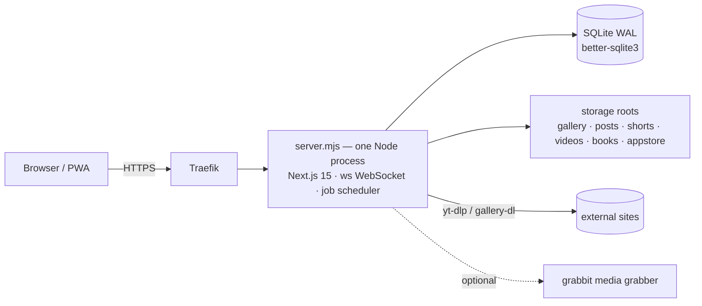
```mermaid
flowchart LR
  B[Browser / PWA] -->|HTTPS| T[Traefik]
  T --> S["server.mjs — one Node process<br/>Next.js 15 · ws WebSocket · job scheduler"]
  S --> D[("SQLite WAL<br/>better-sqlite3")]
  S --> F["storage roots<br/>gallery · posts · shorts · videos · books · appstore"]
  S -->|"yt-dlp / gallery-dl"| X[(external sites)]
  S -.->|optional| G[grabbit media grabber]
```

**One process, three jobs.** The app deliberately skips Next's `standalone`
output in favor of a small custom server (`server.mjs`) that hosts three things
in a single Node process: the Next.js request handler, the raw `ws` WebSocket
endpoint (`/api/ws`) for messaging/presence, and the background-job scheduler.
Same process means the WS layer and jobs can use the same synchronous DB handle
and in-memory state as the app — no IPC, no extra containers.

**Data layer.** Storage is a single SQLite file in WAL mode via
`better-sqlite3`, which is synchronous — queries run to completion on the spot,
so there's no connection pool and no async waterfall for reads. **Kysely** is
used as a type-safe *query builder only*: it compiles the SQL, and
`better-sqlite3` executes it. Reads go through Kysely for type safety; writes
are hand-written prepared statements. Migrations are plain scripts that check
`PRAGMA table_info` before altering.

**Auth & sessions.** Login issues a `jose`-signed JWT in an httpOnly cookie.
Every token carries a `jti` that must exist in a server-side `sessions` table —
so any device can be revoked instantly from Settings, despite JWTs being
stateless by design. Login attempts are throttled in the DB (survives
restarts), and a per-user permissions table lets the admin grant individual
users access to specific settings sections. Adult surfaces sit behind a
per-user PIN with a per-device unlock window.

**Media pipeline.** Uploads are EXIF-parsed (`exifr`), thumbnailed with `sharp`
(every image is stored as a full `<uuid>.jpg` plus a `<uuid>_t.jpg` grid
thumbnail), and geotagged media lands on the Leaflet map. Video imports run
through `yt-dlp` / `gallery-dl` and are transcoded to web-friendly MP4.
Duplicate detection is two-stage: a fast perceptual dHash pass proposes
candidates, then SSIM pixel comparison confirms before anything is flagged.

**Import pipeline.** Each user has a drop tree (`u_<user>/{gallery, posts,
shorts, shorts18, books}`) outside served storage. A filename grammar
(`title [h_tag][f_collection][id_n].ext`) encodes hashtags, albums/playlists
and the DB id; imported files are renamed to that canonical form, so a stored
file re-dropped into the tree is recognized by its `[id_]` and skipped instead
of duplicated. Sidecar `.md` files supply captions.

**Job scheduler.** Imports, polling, transcoding and cleanups are app-level
jobs with DB-persisted schedules, managed from the admin panel (enable,
interval, run-now, view output). The scheduler ticks inside the production
server — no cron or systemd needed for the common case; only jobs that need
host-level access (file ownership fixes) ship as optional systemd units.

**Two kinds of library.** Posts, shorts and gallery media are *imported*: files
move out of a drop tree into per-user served storage and the DB owns the layout.
The long-form video library is the opposite — `VIDEOS_ROOT` stays exactly as you
arranged it on disk and a scan job mirrors it into the DB, so adding a film is a
file copy and removing one is a delete. Nothing there is ever moved or renamed.

**Locked-down front end.** A CSP allows `'self'` only, with two deliberate
exceptions: OpenStreetMap tiles for the gallery map, and `blob:` for the EPUB
iframe and PDF worker. Any external image therefore has to be fetched through
`/api/image-proxy` — pointing an `` straight at a CDN renders broken, by
design.

**PWA & updates.** A service worker makes the app installable; `web-push`
(VAPID) delivers notifications when the app is closed. The client polls
`/api/version` and auto-reloads when a new build is deployed, so stale PWA
JavaScript doesn't linger.

## Guides

In-depth documentation lives in [`guides/`](guides/):

- **[Full setup guide](guides/SETUP.md)** — zero to a running server stack: the
  app, storage roots, the optional grabbit grabber, background jobs, and a
  first-run checklist.
- **[Cookies guide](guides/COOKIES.md)** — exporting and installing the
  `cookies.txt` the Instagram / TikTok sync needs, including an Android
  (phone/tablet) route.
- **[Scripts reference](guides/SCRIPTS.md)** — every script in `scripts/`, what
  it does, and how it's triggered.

The sections below are the quick local start and the full configuration
reference.

## Getting started

This walks you through running the app on your own computer, step by step. No
prior experience needed — just follow each step in order.

**Before you start**, install these two free tools (skip any you already have):

- **Node.js 20 (LTS)** — the runtime that runs the app. Download it from
  [nodejs.org](https://nodejs.org) and pick version 20. To check if you already
  have it, run `node --version` in a terminal; it should print `v20.something`
  (any version from 18.18 up works).
- **Git** — used to download the code. Get it from
  [git-scm.com](https://git-scm.com). Check with `git --version`.

Now open a terminal (Terminal on macOS/Linux, or "Git Bash" / PowerShell on
Windows) and run these commands one at a time:

**Step 1 — Download the code:**

```bash
git clone https://github.com/tjelite1986/elite-v2.git
cd elite-v2
```

This downloads the project into a folder called `elite-v2` and moves you into
it. Every command after this must be run from inside that folder.

**Step 2 — Install the dependencies:**

```bash
npm install
```

This downloads all the libraries the app needs. It can take a few minutes the
first time. You only need to do this again if the project's dependencies change.

**Step 3 — Create your settings file:**

The app needs a few secret settings to run. Create a file named `.env` in the
`elite-v2` folder with this content:

```bash
# Secret key used to sign your login sessions (see note below).
JWT_SECRET=paste-a-long-random-value-here

# The login for the first admin account, created automatically on first start.
ADMIN_EMAIL=you@example.com
ADMIN_PASSWORD=pick-a-password
```

These three are the minimum needed to start. Every other setting (email,
storage folders, push notifications, etc.) is optional and listed under
[Configuration](#configuration) below.

> **What is `JWT_SECRET`?** It's the secret key the app uses to sign your login
> sessions. When you log in, the app gives your browser a signed token; on every
> request it checks that token was signed with this exact key. Anyone who knows
> the value could forge logins and impersonate any user — so keep it secret,
> never commit it, and make it long and random.
>
> You don't strictly need a command — any long string of letters and numbers
> works — but a made-up one is easier to guess, so generating a random value is
> strongly recommended:
>
> ```bash
> # With OpenSSL (available on macOS/Linux):
> openssl rand -base64 32
>
> # Or with Node (which you already installed):
> node -e "console.log(require('crypto').randomBytes(32).toString('hex'))"
> ```
>
> Run either one, copy the output, and paste it as the `JWT_SECRET` value.
> Note: if you change `JWT_SECRET` later, everyone's existing sessions become
> invalid and they'll have to log in again.

**Step 4 — Start the app:**

```bash
npm run dev
```

Wait until it says it's ready, then open **http://localhost:3020** in your web
browser. Log in with the `ADMIN_EMAIL` / `ADMIN_PASSWORD` you set in step 3.

To stop the app, press `Ctrl + C` in the terminal. To start it again later, just
run `npm run dev` from the `elite-v2` folder (steps 1–3 are one-time setup).

> **Want to host it on a server for real (not just your own computer)?** Use the
> Docker + Traefik setup described under [Deployment](#deployment) instead.

### Commands you'll use

These are the everyday commands, run from inside the `elite-v2` folder:

| Command         | What it does                                  |
| --------------- | --------------------------------------------- |
| `npm run dev`   | Start the app for local development (port 3020). |
| `npm run build` | Build the optimized production version.       |
| `npm start`     | Run the production server (`server.mjs`) after a build. |
| `npm run lint`  | Check the code for style/quality problems.    |

For just trying the app out, `npm run dev` is all you need.

### Background jobs (optional — only for a real server)

The app has helper jobs for things like importing media, polling for new shorts,
transcoding videos, cleaning up old stories, and checking for app updates. They
do **not** run on their own — you choose when (and whether) they run.

For just trying the app out you can ignore them entirely; the app works fully
without them.

#### The easy way: the admin panel (recommended)

The simplest option needs no terminal or config. Log in as an admin, open
**Menu** in the bottom bar, choose **Settings**, and pick **Background jobs**
under Admin. There you can, per job:

- **Enable / disable** it — when enabled, the app runs it automatically on a
  schedule.
- **Set the interval** — e.g. every 5 minutes, every 6 hours.
- **Run now** — trigger it once immediately and see the result.

The scheduler runs inside the app server itself (no systemd, no editing files),
and your choices are saved in the database, so they survive restarts. This is
the recommended way for most setups.

> **Note:** the in-app scheduler only ticks when the app runs via the production
> server (`npm start` / the Docker image). In `npm run dev` the panel still works
> and "Run now" still runs, but jobs won't fire automatically.

Every recurring job lives here, including the per-user folder import. A few can
also be started by hand: the drop-folder import has a **Per-user folder import →
Import now** card on each library section's Import tab, and the App Store has
its own scan buttons.

#### The advanced way: systemd timers

If you'd rather schedule the jobs at the operating-system level (so they run even
if the app is restarted independently, with `journalctl` logging), the project
ships systemd unit files in `deploy/systemd/` and `scripts/systemd/`.

> **Don't enable the same job in both places** — pick the admin panel *or* a
> systemd timer for a given job, otherwise it runs twice.

Install and enable them yourself (they are not set up automatically):

```bash
# Copy the timer + service files to systemd, then enable them.
sudo cp deploy/systemd/elitev2-*.{service,timer} /etc/systemd/system/
sudo cp scripts/systemd/elitev2-*.{service,timer} /etc/systemd/system/
sudo systemctl daemon-reload
sudo systemctl enable --now elitev2-shorts-import.timer   # repeat per timer you want
```

**Important — you almost certainly need to edit the unit files first.** They
were written for this specific machine and contain hard-coded values that won't
match your setup:

- **Folder paths** — e.g. `/path/to/storage/elitev2/profile` and
  `/path/to/elite-v2`. Change these to wherever *your* storage folders
  and project live.
- **Container name** — most services run a command inside the Docker container
  named `elitev2` (`docker exec elitev2 ...`). If your container has a different
  name, update it.
- **User/Group** — they run as `User=thomas` / `Group=thomas`. Change to your
  own username.
- **Secrets** — e.g. `APP_UPDATE_SECRET`. Set these to match your `.env`.

Open each `.service` file, adjust those lines, then run the
`daemon-reload` + `enable --now` commands above. Check that a timer is active
with `systemctl list-timers | grep elitev2`, and view a job's output with
`journalctl -u elitev2-shorts-import.service`.

### Importing your own media (drop folders)

Each account has a drop tree under `IMPORT_ROOT`, kept separate from served
storage:

```
<IMPORT_ROOT>/u_<username>/{gallery, posts, shorts, shorts18, books}/
```

Drop files into the matching section and the per-user importer ingests them for
that account (`shorts` → main channel, `shorts18` → 18+, `books` → the shared
library, attributed to you). Two ways to group and tag a file:

- **Subfolder** — a file inside `gallery/holiday/` joins the "holiday" album.
- **Filename tokens** — brackets are the delimiter (so the title may contain
  dots):

  ```
  <title> [h_<tag>]...[f_<collection>][id_<dbid>].<ext>
  ```

  - `[h_tag]` — a hashtag, repeatable. Posts/gallery get real tags; shorts get
    them appended to the caption.
  - `[f_collection]` — the album (gallery) or playlist (shorts) to file it under.
    A bare `[Collection]` (no prefix) still works for backward compatibility.
  - `[id_n]` — the app's DB id; set automatically on stored files and used to
    skip duplicates on re-import.

  e.g. `street food tour [h_streetfood][h_lunch][f_foodtruck].mp4`

A `<stem>.md` sidecar next to a file supplies its caption. Imported files are
renamed to this canonical, self-describing form and moved into the account's
served storage, so they round-trip — re-dropping a stored file is de-duplicated
by its `[id_]`. The `user-import` background job does this on a schedule; to run
it once, use **Settings → Photos → Import → Per-user folder import**.

## Configuration

Configure via environment variables (e.g. an `.env` file — not committed):

### Core

| Variable                      | Description                                          |
| ----------------------------- | ---------------------------------------------------- |
| `JWT_SECRET`                  | **Required.** Secret used to sign session JWTs.      |
| `ADMIN_EMAIL` / `ADMIN_PASSWORD` | Seed the initial admin account on first run.       |
| `DATA_DIR`                    | Data directory (default: `./data`). Holds the SQLite DB (`elitev2.db`). |
| `APP_URL`                     | Public base URL, used in outgoing email/push links.  |
| `PORT` / `HOSTNAME`           | Bind address for the production server (default `0.0.0.0:3000`). |
| `BACKUP_DIR` / `BACKUP_KEEP`  | Where the nightly `VACUUM INTO` snapshot lands (default `/backup`) and how many to keep (default 14). |

### Storage roots

| Variable        | Description                                            |
| --------------- | ----------------------------------------------------- |
| `PROFILE_ROOT`  | Per-user **served** content root: `u_<user>/{gallery,posts,shorts,shorts18,cookies}`. |
| `IMPORT_ROOT`   | Top-level per-user **drop** tree (staging, kept separate from served storage): `u_<user>/{gallery,posts,shorts,shorts18,books}`. See [drop folders](#importing-your-own-media-drop-folders). |
| `GALLERY_ROOT`  | Legacy central gallery root — read-only fallback for pre-per-user media. |
| `POSTS_ROOT`    | Posts media for mirrored creators + avatars/banners (legacy bulk-import drop). |
| `SHORTS_ROOT`   | Shorts media for mirrored creators / auto-poll (legacy bulk-import drop). |
| `VIDEOS_ROOT`   | **Scanned, not imported.** Long-form video library: `main/` feeds `/videos`, `adults/` feeds `/videos18`. Your folder structure is preserved as-is. |
| `BOOKS_ROOT`    | **Shared** bookshelf storage (EPUB / PDF / CBZ) — one library for all users. |
| `APPSTORE_ROOT` / `STORE_DIR` | App Store catalog / APK archive storage.|

### Email

| Variable        | Description                                            |
| --------------- | ----------------------------------------------------- |
| `MAIL_FROM`     | "From" address for outgoing email.                    |
| `SMTP_HOST` / `SMTP_PORT` / `SMTP_USER` / `SMTP_PASS` | SMTP credentials for `nodemailer`. |

### Web Push

| Variable          | Description                                          |
| ----------------- | --------------------------------------------------- |
| `VAPID_PUBLIC_KEY` / `VAPID_PRIVATE_KEY` / `VAPID_SUBJECT` | VAPID keys for `web-push`. |

### Import / integrations

| Variable              | Description                                          |
| --------------------- | --------------------------------------------------- |
| `IMPORT_DIR` / `POSTS_IMPORT_DIR` / `SHORTS_IMPORT_DIR` | Legacy *creator* bulk-import drop dirs (distinct from the per-user `IMPORT_ROOT` tree). |
| `IMPORT_CRON_SECRET`  | Shared secret for import trigger endpoints.         |
| `GRABBIT_URL` / `GRABBIT_INTERNAL_TOKEN` | URL and shared token of an optional external media-grabber service, e.g. [grabbit](https://github.com/tjelite1986/grabbit); enables the shorts "Grab from web" button. The token authenticates container-to-container calls — without it any container on the shared network could use grabbit. (`LADDA_URL` is honored as a legacy alias.) |
| `IG_COOKIES_ROOT` / `IG_COOKIES_PATH` / `IG_SRC` | Instagram cookie pool folder, the default cookie file, and the sync source. See the [cookies guide](guides/COOKIES.md). |
| `IG_MAX_PER_RUN` / `IG_MAX_PER_COOKIE_PER_RUN` / `IG_RETRIES` / `IG_SLEEP_REQUEST` / `IG_PROFILE_SLEEP_SECONDS` / `IG_COOLDOWN_MINUTES` | Instagram rate-limit pacing: batch caps, retries, per-request and per-profile delays, and how long a blocked cookie is benched (default 60 min). |
| `TIKTOK_COOKIES_ROOT` / `TIKTOK_COOKIES_PATH` | TikTok cookies (optional — public profiles download anonymously). |
| `TT_MAX_PER_RUN` / `TT_RETRIES` / `TT_PROFILE_SLEEP_SECONDS` | TikTok sync pacing. |
| `GALLERY_DL_BIN` / `YT_DLP_BIN` / `CURL_IMPERSONATE_BIN` | Paths to external download tools. `yt-dlp` is not in the image — bind-mount one and point this at it. |
| `TPDB_API_KEY`        | ThePornDB key for the 18+ video metadata job. Optional: `.nfo` sidecars are matched without it. |
| `NAVIDROME_URL` / `NAVIDROME_KIDS_URL` | Navidrome servers behind `/music`. The first is the main library; the second is optional and only shown when it answers. |
| `NAVIDROME_ADMIN_USER` / `NAVIDROME_ADMIN_PASSWORD` | Navidrome admin login, used once per Elite user to create their own Navidrome account. Without it, `/music` asks each user to link an existing account instead. |
| `GITHUB_TOKEN` / `FDROID_REPO_URL` | App Store import sources.             |
| `APP_UPDATE_URL` / `APP_UPDATE_SOURCE` / `APP_UPDATE_SECRET` / `APP_UPDATE_PULL` / `APP_IMPORT_HOST_DIR` | App auto-update and APK drop-folder wiring. |
| `ADULTS_EMAIL` / `PUBLIC_EMAIL` | Seeded content-owner accounts.            |
| `VIDEOS_KEEP_ORIGINALS` | Keep the source file when the transcode job rewrites a video (default: replace). |

### Widgets & AI

| Variable              | Description                                          |
| --------------------- | --------------------------------------------------- |
| `WEATHER_PLACE` / `WEATHER_LAT` / `WEATHER_LON` | Location for the dashboard weather widget (Open-Meteo, no API key needed). |
| `PERPLEXITY_API_KEY`  | Enables the `/ask` AI search page. Without it the page reports the feature as unconfigured. |
| `PERPLEXITY_MODEL` / `PERPLEXITY_SYSTEM_PROMPT` | Override the model and system prompt used for `/ask`. |

> The app uses a custom server (`server.mjs`) rather than Next's `standalone`
> output, because the WebSocket endpoint (`/api/ws`) is hosted in the same
> process as Next.

## Deployment

Built and run as a Docker container behind a [Traefik](https://traefik.io)
reverse proxy that terminates TLS (Let's Encrypt via the Cloudflare DNS
challenge).

```bash
docker compose build
docker compose up -d
```

> Operationally deployed from `docker2/compose/elitev2/` on the host (that dir
> holds the `.env` and the Traefik labels below). `--no-cache` is only needed
> when `package.json` changes.

The SQLite database and uploaded media live in a persistent volume mounted at
`DATA_DIR` (plus the dedicated storage roots above).

### Putting it behind Traefik

The container does **not** publish ports. Traefik discovers it over a shared
Docker network and routes by hostname, so both the app and Traefik must be on
the same external network (here named `traefik`):

```yaml
# docker-compose.yml (excerpt)
services:
  elitev2:
    build:
      context: /path/to/elite-v2
      dockerfile: Dockerfile
    container_name: elitev2
    restart: unless-stopped
    networks:
      - traefik           # same external network Traefik runs on
    environment:
      - NODE_ENV=production
      - PORT=3000         # internal port Traefik forwards to
      - HOSTNAME=0.0.0.0
      # ...app env vars (see Configuration) loaded from .env...
    volumes:
      - elitev2_data:/app/data
      # ...storage-root bind mounts...
    labels:
      - "traefik.enable=true"
      - "traefik.http.routers.elitev2-secure.rule=Host(`elitev2.example.com`)"
      - "traefik.http.routers.elitev2-secure.entrypoints=https"
      - "traefik.http.routers.elitev2-secure.tls=true"
      - "traefik.http.routers.elitev2-secure.tls.certresolver=cloudflare"
      - "traefik.http.services.elitev2-service.loadbalancer.server.port=3000"

volumes:
  elitev2_data:

networks:
  traefik:
    external: true        # created/owned by the Traefik stack
```

What each label does:

| Label | Purpose |
| ----- | ------- |
| `traefik.enable=true` | Opt this container in to Traefik routing. |
| `routers.elitev2-secure.rule=Host(...)` | Match requests for the public hostname. Point a DNS record at the host. |
| `routers.elitev2-secure.entrypoints=https` | Serve on the HTTPS entrypoint (`:443`). |
| `routers.elitev2-secure.tls=true` + `tls.certresolver=cloudflare` | Terminate TLS using the `cloudflare` ACME resolver defined in Traefik's static config. |
| `services.elitev2-service.loadbalancer.server.port=3000` | Forward to the container's internal port (`PORT`), since no ports are published. |

Prerequisites on the Traefik side (configured once, in Traefik's own static
config — not here):

- An `https` entrypoint on `:443` (with an `http` → `https` redirect on `:80`).
- A `cloudflare` `certResolver` using the Cloudflare DNS-01 challenge
  (Cloudflare API token + ACME email), so wildcard/subdomain certs for
  `*.example.com` are issued automatically.
- The external `traefik` Docker network, which this stack joins.

When all of that is in place, `docker compose up -d` is enough — Traefik picks
up the new container via the Docker provider and starts routing
`https://elitev2.example.com` to it.

## Troubleshooting

Common problems and how to fix them.

**`npm run dev` exits immediately or says `JWT_SECRET` is missing.**
The app needs the settings from step 3. Make sure there is a file named exactly
`.env` (not `.env.txt`) in the `elite-v2` folder, and that it contains at least
`JWT_SECRET`. Then run `npm run dev` again.

**"Port 3020 is already in use" (or the page won't load).**
Another program — often an old copy of this app — is using the port. Stop it
with `Ctrl + C` in the terminal where it's running, or start this one on a
different port: `npm run dev -- -p 3025`, then open `http://localhost:3025`.

**`npm install` fails while building `better-sqlite3` or `sharp`.**
These are native modules that compile on install. On Linux you need the build
tools first: `sudo apt-get install -y python3 make g++`. On macOS, install the
Xcode command line tools with `xcode-select --install`. Then run `npm install`
again.

**The app starts but uploading/processing images fails (`sharp` error).**
`sharp` needs the binary that matches your machine. Reinstall it fresh:
`npm rebuild sharp`, or remove `node_modules` and run `npm install` again.
(The lockfile here is generated on a Raspberry Pi / arm64, so on other platforms
`sharp`'s binary may need this rebuild — the CI workflow does the same thing.)

**I can't create a new account — registration is blocked.**
That's by design: Elite v2 is **invite-only**. The first admin account is
created from `ADMIN_EMAIL` / `ADMIN_PASSWORD` on first start. Log in as that
admin and generate a registration code (or approve an invite request) for
anyone else.

**Login keeps failing even with the right password.**
After several failed attempts the login is temporarily throttled (a security
feature). Wait a few minutes and try again. If you genuinely forgot the admin
password, stop the app, set a new `ADMIN_PASSWORD` in `.env`, and restart — but
note the admin account is only seeded if it doesn't already exist, so for an
existing account you'll need to reset it in the database.

**Docker: the site shows "Bad Gateway" or a 404 from Traefik.**
Usually one of: the container isn't on the same external `traefik` network; the
`loadbalancer.server.port` label doesn't match the container's internal `PORT`
(both must be `3000`); or the `Host(...)` rule doesn't match the domain you're
visiting. Check `docker logs elitev2` and confirm the labels in
[Deployment](#deployment).

**Docker: `better-sqlite3` crashes with `ERR_DLOPEN_FAILED` at startup.**
The native module was built against a different Node version than the one in the
image. Rebuild the image without cache so it compiles against the right runtime:
`docker compose build --no-cache && docker compose up -d`.

**Docker: "permission denied" writing to a mounted storage folder.**
The container writes as a non-root user. Make sure the host folders mounted as
storage roots (gallery, posts, shorts, etc.) are writable — e.g.
`chmod -R 777 /path/to/storage` for a quick local fix.

**Downloading a video or polling a creator fails with "yt-dlp not found".**
`yt-dlp` is not baked into the image on purpose — it changes too often. Put a
current binary on the host, bind-mount it into the container, and point
`YT_DLP_BIN` at that path. `gallery-dl`, `instaloader` and `ffmpeg` *are* in the
image and need no setup.

**An external image renders as a broken icon.**
The Content-Security-Policy is `img-src 'self'` (plus OpenStreetMap tiles), so
a remote URL in an `` is blocked by the browser. Route it through
`/api/image-proxy` instead — that's how link previews and store icons load.

**Videos I copied into `VIDEOS_ROOT` don't show up.**
That library is scanned, not imported, so nothing appears until the
`videos-scan` job runs. Enable it under **Settings → Background jobs**, or hit
**Rescan library** on the Videos page.

## CI

GitHub Actions runs on every push and pull request to `main`:

- **Typecheck & build** — `tsc --noEmit` and `next build`. Because the lockfile
  is generated on arm64 (Raspberry Pi), the workflow installs the linux-x64
  `sharp` binary explicitly before building.
- **npm audit** — fails the build on `critical` vulnerabilities; `high` and
  `moderate` are reported but non-blocking.

Dependency updates are managed by Dependabot (npm and GitHub Actions, weekly).
